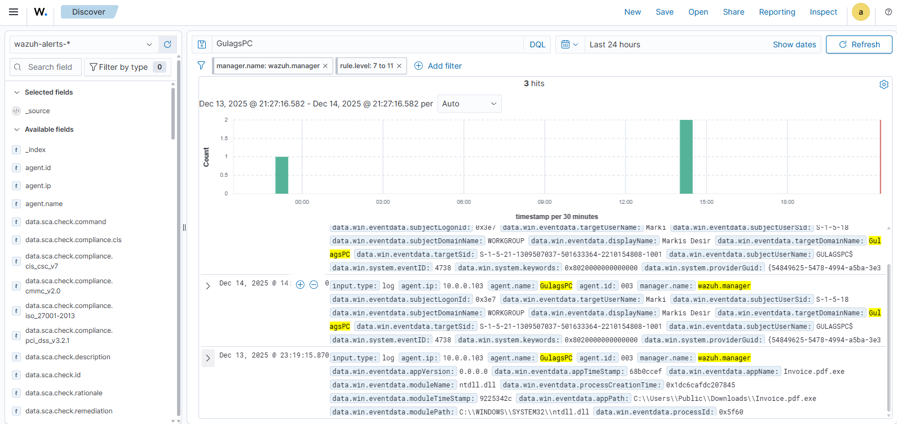
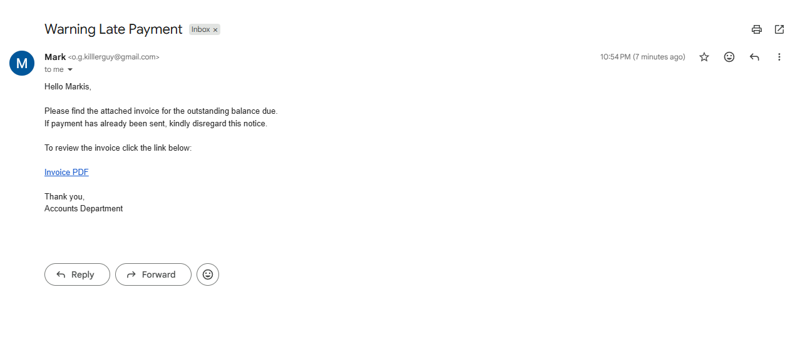
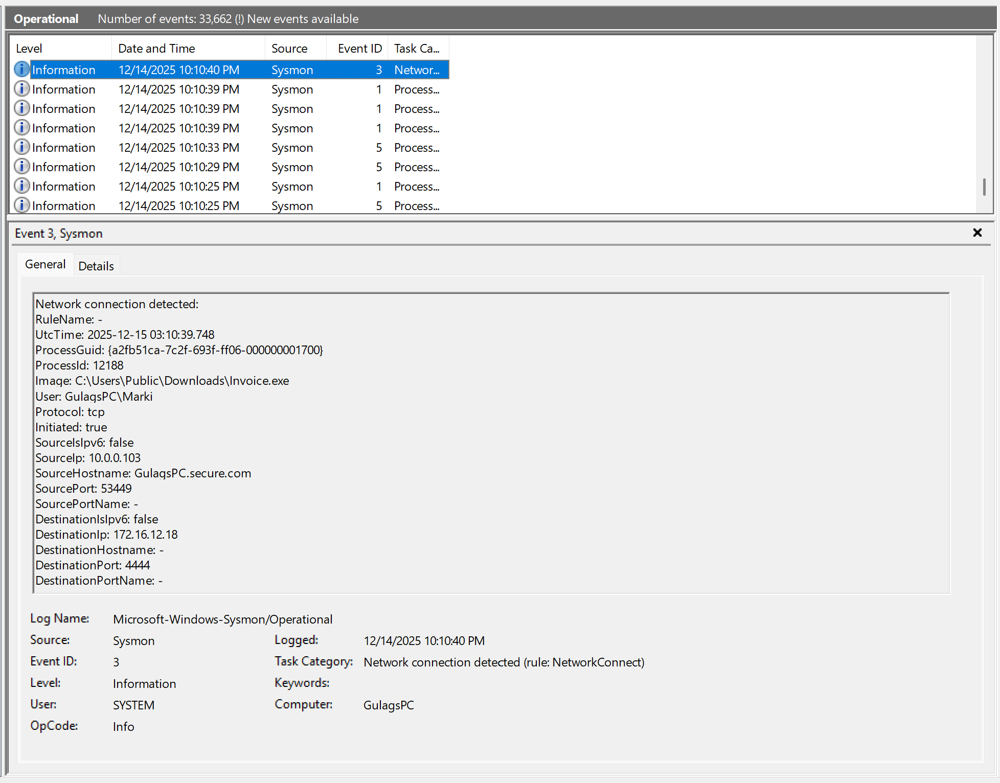
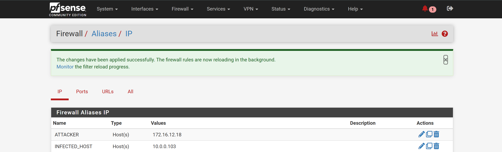
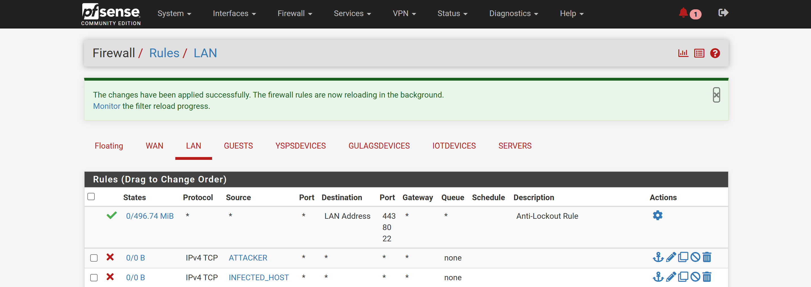
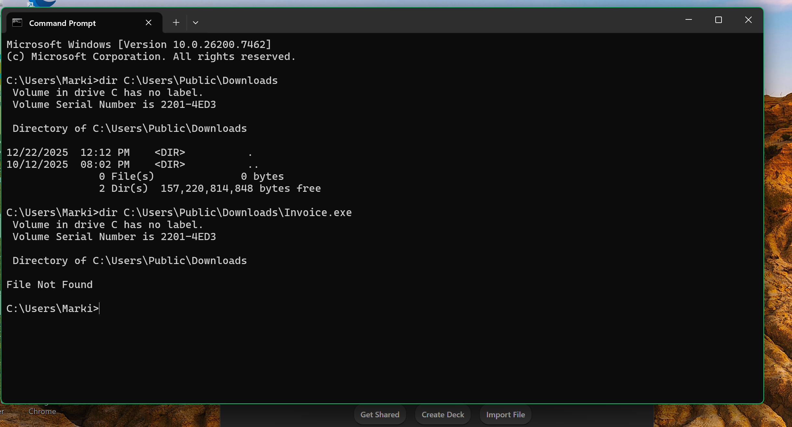

# Incident-Response-Lab-Phishing-Reverse-Shell-Simulation

### Project Overview

This project simulates a real-world phishing attack and end-to-end incident response workflow within a controlled lab environment. A malicious phishing email delivered a reverse shell payload to a Windows 11 system, resulting in unauthorized command-and-control (C2) access. The incident was detected using centralized logging and endpoint telemetry, analyzed through process and network evidence, and contained using firewall-based isolation. The project follows the NIST SP 800-61 Incident Response lifecycle, covering preparation, detection, analysis, containment, eradication, recovery, and lessons learned, and demonstrates practical SOC, SIEM, and network defense techniques.
   

## Excecutive Summary

Between December 13 and December 14, a phishing email containing a malicious link was delivered to a Windows 11 machine. The user accessed the link and executed a downloaded malicious executable, resulting in a reverse shell connection to an external attacker-controlled system. Wazuh SIEM detected suspicious process execution and outbound network activity, enabling timely investigation and containment. No evidence of data exfiltration was observed.
   

## Incident Overview

**Standard:** NIST SP 800-61

- **Incident Type:** Phishing → Malware Execution → Command and Control
- **Affected System:** Windows 11 Virtual Machine
- **Detection Method:** Wazuh SIEM
- **Severity:** Medium–High (Unauthorized remote access established)
   

## Preparation

### Network Monitoring & Defense Tools
- Wazuh SIEM for centralized log collection and alerting
- Suricata IDS/IPS for network traffic inspection
- pfSense firewall for network segmentation and containment

### Endpoint Visibility
- Windows Event Viewer
- Sysmon for detailed process and network telemetry
- Windows Defender for baseline endpoint protection
   

## Detection & Analysis 

### Suspicious Process Execution

* The image above shows the execution of a suspicious executable named **`Invoice.pdf.exe`** on **December 13, 2025 at 11:19 PM** on the endpoint **GulagsPC**.
* The executable was launched from a **`C:\Users\Public\Downloads\`** directory, a common location abused by phishing-based malware due to minimal execution restrictions and user trust.
* The filename demonstrates **masquerading behavior**, using a double file extension to appear as a legitimate PDF document while executing as a Windows executable.
* This activity is indicative of **user-driven malware execution following a phishing event**, and served as the initial indicator prompting further investigation.

###  Suspicious Process Log 

**Fig.1**

---

  

### Phishing Email
* Fig.2 shows the phishing email used as the initial access vector.
* The email **impersonated an Accounts Department** and warned the recipient of a late payment and outstanding balance, **applying urgency to prompt user action**.
* The sender address **`o.g.killlerguy@gmail.com`** is **inconsistent with a legitimate corporate** billing domain, **indicating spoofing or impersonation**.
* The subject line referenced a late payment warning, a **common phishing theme used to pressure recipients** into clicking embedded links.
* The email contained a **malicious link** that directed the user to an **attacker-controlled Python web server** hosting the **malicious executable**, leading to the subsequent compromise.

### Suspicious Email
  
**Fig. 2**

---
  

### Sysmon Network Connection Event

* The Sysmon event (Event ID 3 – **Network Connection**) shows `Invoice.exe` initiating an outbound network connection following execution.
* **Source IP:** `10.0.0.103`
* **Source Port:** `53449`
* **Destination IP:** `172.16.12.18`
* **Destination Port:** `4444`
* **Protocol:** TCP
* **Timestamp:** `12/14/2025 10:10:40`
* The executable path is confirmed as `C:\Users\Public\Downloads\Invoice.exe`, correlating directly with the suspicious process execution observed earlier.
* The connection to a non-standard port commonly used for reverse shells indicates **successful command-and-control communication** with an external attacker system.

### Sysmon Event

**Fig.3**

---
  

## MITRE ATT&CK Mapping

| Tactic            | Technique ID | Description                | Evidence Refrence |
|-------------------|--------------|----------------------------|-------------------|
| Initial Access    | T1566.002    | Phishing Link              | Fig.2             |
| Execution         | T1204.002    | User Execution             | Fig.1             |
| Command & Control | T1105        | Ingress Tool Transfer      | Fig.3             |
| Command & Control | T1071        | Application Layer Protocol | Fig.3             |

  

## Containment

### Creation of Aliases for Infected Host and Attacker
Firewall aliases were created to clearly identify and manage both the compromised host and the attacker infrastructure:

* **INFECTED_HOST:** 10.0.0.103
    * Represents the compromised Windows 11 workstation
* **MALICIOUS_C2:** 172.16.12.18
    * Represents the attacker system hosting the reverse shell listener

Using aliases improves rule clarity, auditability, and aligns with enterprise firewall management best practices.

### Firewall Aliases

**Fig.4**

---
  

### Firewall Rules for Host Isolation and C2 Blocking
Firewall rules were applied on the LAN interface to enforce containment:

* Host Isolation Rule:
    * Blocked all network traffic originating from the infected host (10.0.0.103)
    * Prevented lateral movement and further outbound connections
* C2 Blocking Rule:
    * Blocked all traffic destined for the attacker IP (172.16.12.18)
    * Prevented command-and-control (C2) communication and reinfection attempts

C2 blocking refers to disrupting communication between compromised systems and attacker-controlled infrastructure, a critical containment step to stop active attacker control.

These rules ensured the threat was contained while preserving forensic evidence for continued analysis.

### Firewall Rules

**Fig.5**

  

## Eradication 

### Malicious File Removal

The malicious executable identified during analysis (Invoice.exe) was located in the user’s public downloads directory and removed from the system.

* File path:
`C:\Users\Public\Downloads\Invoice.exe`

* Action taken
    * Malicious file deleted
    * Recycle Bin cleared
    * File presence revalidated to ensure removal

This step ensured the initial payload responsible for the reverse shell connection could no longer be executed.

---

### Persistence Verification

After removal of the malicious executable, common Windows persistence mechanisms were reviewed to confirm that no additional attacker footholds existed.

* The following locations were inspected:
* Registry Run keys (`HKCU` / `HKLM`)
* Scheduled Tasks
* Startup folders
* Running processes and active network connections

No evidence of persistence mechanisms, scheduled tasks, or registry autoruns related to the malware was identified.

---

### Process and Network Validation

System processes and network activity were reviewed to confirm that no malicious processes remained active and that no further outbound connections to the attacker infrastructure were occurring.

* No suspicious processes observed
* No additional outbound connections to the previously identified attacker IP
* No re-execution of the malicious payload detected in logs

This confirmed that the threat had been fully removed from the endpoint.

---

### Security Scan

* A **Microsoft Defender Full Scan** was executed on the affected Windows 11 system.
* The scan completed successfully with **no additional threats detected**, confirming eradication of the malicious payload.

---

### Eradication Outcome

All identified malicious artifacts were successfully removed, and no evidence of persistence or continued compromise was observed. The system remained isolated pending recovery actions and continued monitoring.

   

## Recovery 

Following successful eradication of the malicious payload and confirmation that no persistence mechanisms remained, recovery actions were initiated to safely **return the affected system to normal operation**.

Network access for the infected Windows 11 virtual machine was gradually restored by removing the host isolation rule in the pfSense firewall. The attacker **command-and-control (C2)** IP address `(172.16.12.18)` remained blocked to **prevent any potential reinfection** or **follow-on communication attempts**.

The endpoint was closely **monitored through Wazuh SIEM after network restoration** to detect any recurrence of suspicious activity, including abnormal process execution, outbound network connections, or authentication anomalies. **No additional indicators of compromise** were observed during the monitoring period.

**Normal system functionality was confirmed**, and the endpoint was returned to operational status with continued security logging and monitoring enabled.

   

## Post-Incident Activity / Lessons Learned 
Following incident containment, eradication, and recovery, a post-incident review was conducted to assess the effectiveness of existing controls and identify areas for improvement.

### What Went Well

* The phishing-based attack was successfully detected through centralized logging and monitoring provided by the Wazuh SIEM.
* Sysmon telemetry enabled visibility into both malicious process execution and subsequent command-and-control network activity.
* Firewall-based containment using pfSense effectively disrupted attacker communication and prevented further compromise.
* No evidence of data exfiltration or lateral movement was observed.

### Identified Gaps

* The phishing email successfully leveraged social engineering tactics, indicating insufficient user awareness regarding suspicious senders and invoice-themed emails.
* The malicious executable was downloaded and executed from a publicly accessible user directory, highlighting a lack of controls restricting executable content in common download locations.
* Email-based threat detection and attachment/link inspection controls were not present in the simulated environment.

### Recommended Improvements

* Implement security awareness training focused on phishing identification, particularly invoice and payment-related lures.
* Restrict or monitor execution of files from user-accessible directories such as Downloads and Public folders.
* Enhance email security controls, including link analysis and attachment filtering.
* Expand Wazuh correlation rules to better associate phishing events with subsequent execution and network activity.
* Continue leveraging firewall-based containment procedures as part of the incident response playbook.

### Overall Assessment

The incident response process effectively identified, contained, and remediated the threat with minimal impact. The exercise validated the effectiveness of SIEM monitoring and network-level containment while highlighting opportunities to strengthen preventive controls and user awareness.

   

    
